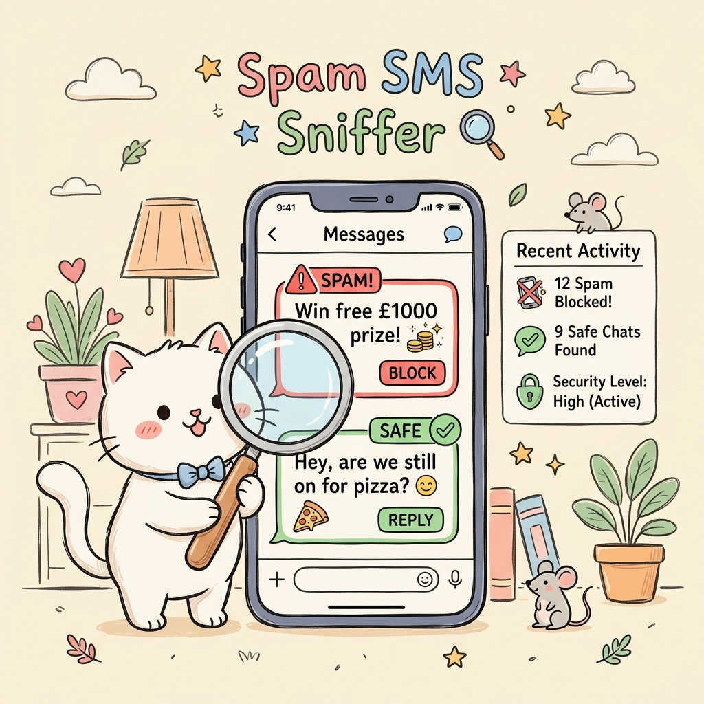

# 🐾 Spam SMS Sniffer - Cat Classifier 🐈

Welcome to **Spam SMS Sniffer**, a playful, doodley-style SMS Spam Classifier powered by **Flask**, **scikit-learn**, and custom hand-drawn aesthetics using **Tailwind CSS**. 

The app features a helpful cat assistant named **Yuki** who sniffs out suspicious text messages and categorizes them as **Ham (Safe)** or **Spam (Danger)**!

---

## 🎨 App Preview



---

## 🚀 Key Features

* **🐱 Polaroid Cat Inspector:** Displays a cute white cat picture at the top. Cycle through different cats with the "Next Cat 🐾" button.
* **✍️ Sketchbook / Doodle Theme:** Styled like a retro school notebook with warm cream grid lines, notebook-style yellow legal pad textareas, and tactile Neo-brutalism sketchy borders and drop-shadows.
* **💡 Quick-Test Templates:** Includes click-to-type test templates for both Ham and Spam to easily see the classifier in action.
* **⚡ AJAX Smoothness:** Asynchronous message inspection using `fetch` to ensure zero-lag, no-page-reload classification and beautiful bounce/slide transitions.
* **🔌 Zero-Config Fallback:** Fully operational front-end local fallback engine that uses keyword heuristics to classify messages even if the backend scikit-learn model experiences errors.

---

## 🛠️ File Structure

* [app.py](file:///c:/Users/karan/Desktop/Sleepyy/SMS%20Spam%20Detection/app.py) - Main Flask application routing and ML prediction endpoints.
* [templates/index.html](file:///c:/Users/karan/Desktop/Sleepyy/SMS%20Spam%20Detection/templates/index.html) - Doodle-themed HTML frontend dashboard.
* [porter.py](file:///c:/Users/karan/Desktop/Sleepyy/SMS%20Spam%20Detection/porter.py) - Self-contained, pure-Python implementation of the Porter Stemmer algorithm (used as a fallback to match sklearn features when NLTK is not available).
* [model.pkl](file:///c:/Users/karan/Desktop/Sleepyy/SMS%20Spam%20Detection/model.pkl) - Pre-trained Multinomial Naive Bayes classification model.
* [vectorizer.pkl](file:///c:/Users/karan/Desktop/Sleepyy/SMS%20Spam%20Detection/vectorizer.pkl) - Fitted TF-IDF Text Vectorizer.

---

## 🏃 How to Run the App

1. Ensure you have the required Python libraries installed:
   ```bash
   pip install Flask scikit-learn pandas
   ```
2. Navigate to the project directory:
   ```bash
   cd "SMS Spam Detection"
   ```
3. Start the Flask server:
   ```bash
   python app.py
   ```
4. Open your browser and go to:
   [http://127.0.0.1:5000/](http://127.0.0.1:5000/)

---

## 🐾 How it Works (Under the Hood)

1. **Text Preprocessing:** When a message is submitted, the text is lowercased and tokenized. Stopwords (common English words that don't add meaning) and punctuation are removed.
2. **Stemming:** Words are reduced to their root forms (e.g., `crazy` -> `crazi`, `available` -> `avail`) using the **Porter Stemmer** algorithm.
3. **Vectorization:** The cleaned words are converted to a TF-IDF numeric vector matching the vocabulary of `3000` features used during model training.
4. **Prediction:** A **Multinomial Naive Bayes (MNB)** classifier calculates the probability of the message being **Spam** or **Ham** and returns the final verdict.
